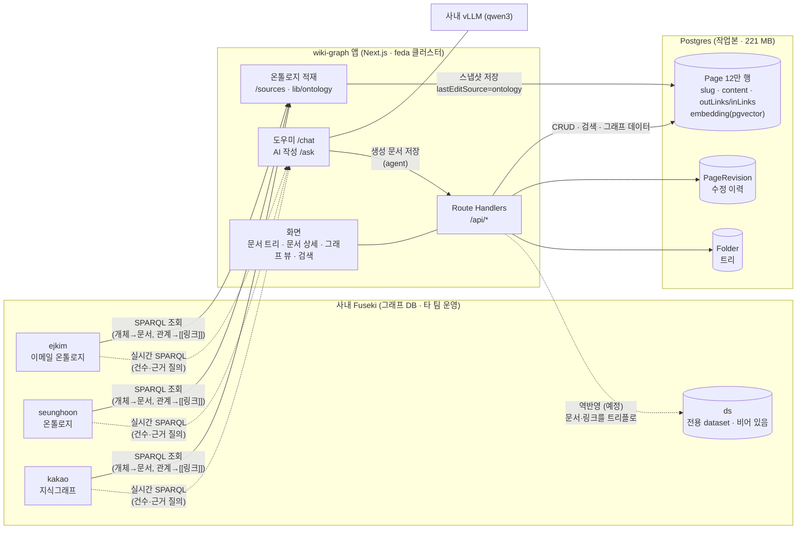

# 시스템 구조도

2026-08-06 기준. 저장 구조 논의(그래프 DB 기반 vs RDB)의 결론 반영 —
**Fuseki = 지식의 원본, Postgres = 위키 작업본**, 역반영은 예정.

## 전체 구조

## 데이터 흐름 요약

| 흐름 | 경로 | 시점 |
|---|---|---|
| 온톨로지 적재 | Fuseki → Postgres `Page` | 수동 (/sources). 사람이 고친 문서는 안 덮음 |
| 실시간 그래프 질의 | /chat·/ask → Fuseki SPARQL 직행 | 매 질문. Postgres 안 거침 |
| 문서 편집·검색·그래프 뷰 | 화면 → /api/* → Postgres | 매 요청. Fuseki 안 거침 |
| AI 문서 저장 | /ask·/chat → `Page` (editSource=agent) | 저장 시 `[[링크]]` 파싱 → outLinks/inLinks 동기화 |
| 역반영 | Postgres → 전용 dataset `ds` | **미구현 (다음 단계)** — 이걸로 "그래프=진실" 완성 |

## 역할 분담 원칙

- **Fuseki (그래프 DB)** — 지식의 원본. 개체·관계. 관계 질의(SPARQL)와 타 팀 연동.
  타 팀 인프라라 읽기 전용, 우리 쓰기는 전용 dataset(`ds`)에만 (예정).
- **Postgres (RDB)** — 위키 작업본. 그래프 DB가 못 하는 것 전담:
  마크다운 본문 저장, 리비전·낙관적 잠금·휴지통, 한국어 부분문자열 검색,
  pgvector 의미검색, 트리 페이징. 그래프에서 재구축 가능한 파생물로 취급.
- **그래프 뷰(/graph)** — Fuseki가 아니라 `Page.outLinks`에서 계산.
  문서 트리와 같은 기준(적재본 제외), 연결 상위 200개만 렌더.

## 관련 문서

- 그래프 DB vs RDB 역할 상세(적재 이유·검색 경로·FAQ): `docs/db-roles.md`
- 실행·배포·Fuseki 현황: `README.md`
- RAG 파이프라인(/ask 내부): `docs/rag-architecture.md`
- UI 표준: `docs/design.md`
- 기능 목록: `docs/기능정의서.md`
