# GraphWiki 사용자 매뉴얼

주식회사 성진 사내 지식 위키 — 버전 0.36.0 기준 (2026-08-07)

사내 지식 그래프(이메일·카카오톡·업무 문서)를 위키 문서로 읽고, 연결하고, AI로 정리하는 워크스페이스입니다.

---

## 1. 접속과 로그인

| 구분 | 주소 |
|---|---|
| 외부·사내 공통 | `https://cloud.fedaground.com/graphwiki` |
| 사내망 직통 | `http://192.168.0.103:31900` |

발급받은 아이디와 비밀번호로 로그인합니다. 계정이 없으면 관리자에게 문의하세요.
"로그인 상태 유지"를 체크하면 30일간 로그인이 유지됩니다(미체크 시 8시간).
비밀번호를 5회 연속 틀리면 10분간 잠깁니다.

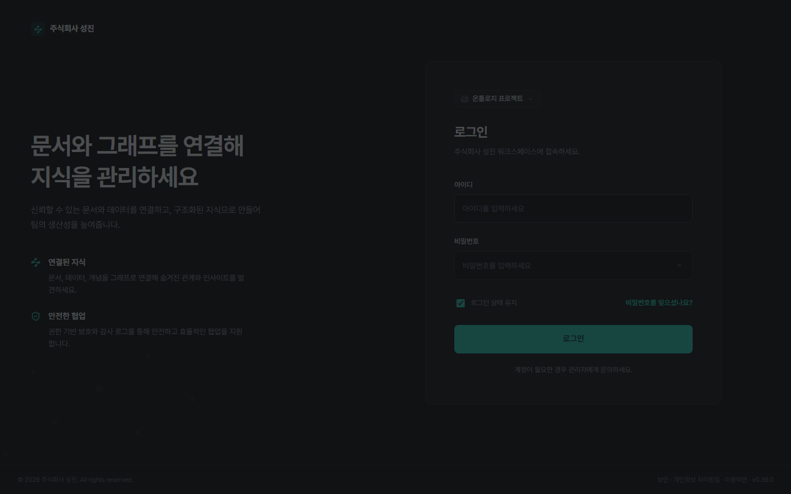

---

## 2. 홈과 문서 트리

로그인하면 홈 화면이 열립니다. 왼쪽부터 **글로벌 메뉴**(홈·그래프·AI 작성·채팅·휴지통·설정), **문서 트리**, **본문 영역**입니다.

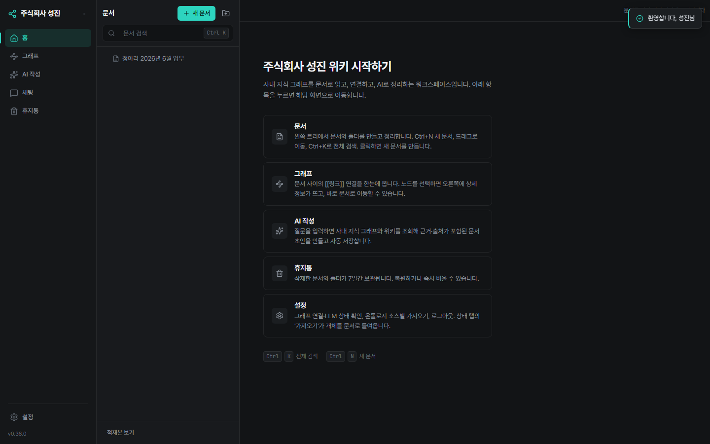

- **문서 검색**: 트리 상단 검색창 또는 `Ctrl+K`. 두 글자 이상 입력하면 결과가 나타납니다.
- **새 문서**: `+ 새 문서` 버튼 또는 `Ctrl+N`. 노션처럼 즉시 만들어지고 편집 모드로 열립니다.
- **적재본 보기**: 트리 하단 토글. 기본 트리는 사람·AI가 만든 문서만 보여주며, 켜면 온톨로지에서 자동 적재된 문서(이메일·카카오톡·업무 문서 18만여 건)까지 표시됩니다.
- 문서·폴더는 드래그로 옮길 수 있고, 우측 `…` 메뉴에서 이름 변경·이동·삭제할 수 있습니다.
- 로고 옆 햄버거 버튼으로 사이드바 전체를 접을 수 있습니다.

---

## 3. 문서 보기

문서를 열면 제목 아래 메타데이터(유형·수정일·작성 주체·링크 수)와 본문이 표시됩니다.

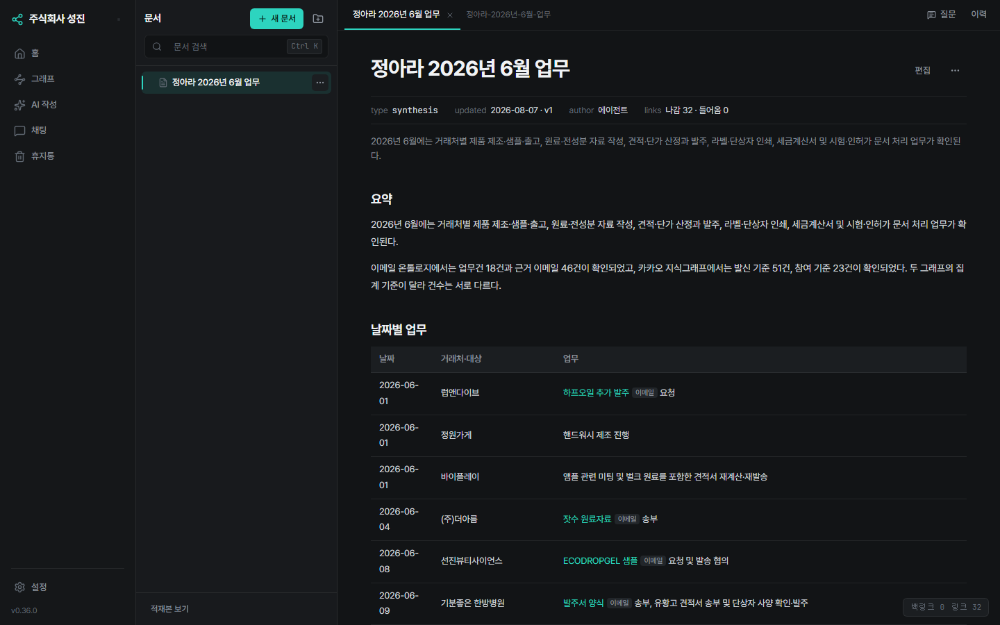

- 본문의 **초록색 링크**는 근거 문서로 연결됩니다. 링크 옆 작은 배지가 출처 유형을 알려줍니다 — `이메일`(메일 원문), `카톡`(카카오톡 기록), `문서`(업무 문서).
- 열어 본 문서는 상단 **탭**으로 유지됩니다(최대 8개).
- 상단 우측 `이력` 버튼으로 버전 히스토리를 보고 이전 버전으로 되돌릴 수 있습니다.
- 문서 하단에는 이 문서를 가리키는 **백링크** 목록이 표시됩니다.

---

## 4. 문서에 질문 (사이드 챗)

문서 보기 화면 상단의 **질문** 버튼을 누르면 오른쪽에 대화 패널이 열립니다.
지금 보고 있는 문서 내용을 근거로 질문할 수 있습니다.

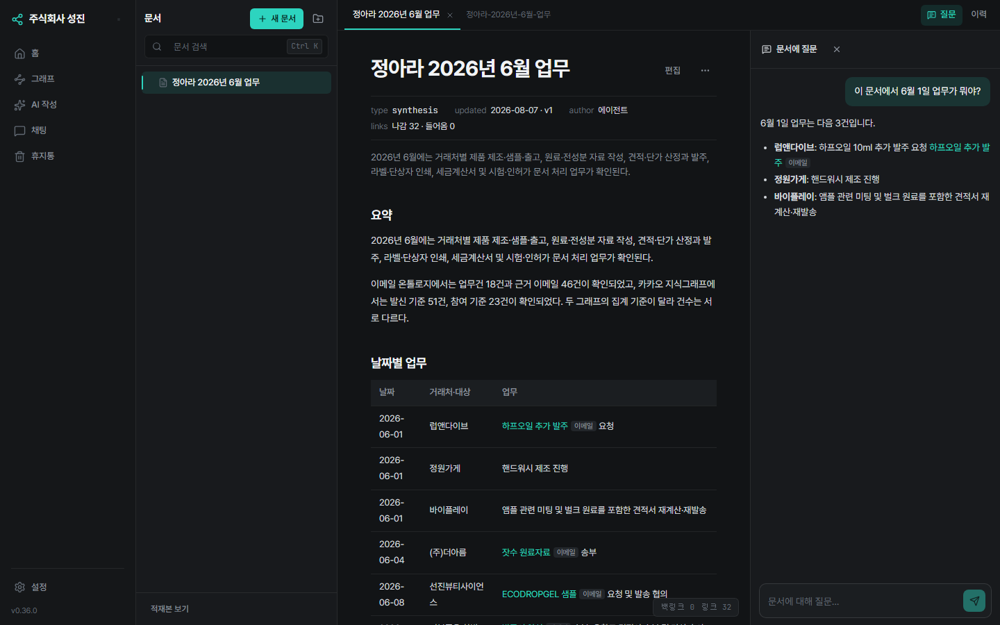

- 답변에도 근거 문서 링크와 출처 배지가 달립니다.
- 이 대화는 **저장되지 않으며**, 다른 문서로 이동하면 초기화됩니다.

---

## 5. 문서 편집

문서 보기에서 **편집** 버튼을 누르면 편집기가 열립니다.

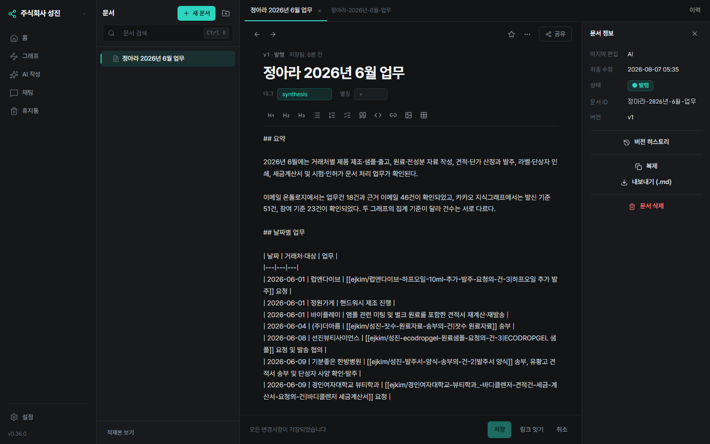

- **서식 툴바**: 제목·목록·체크리스트·인용·코드·위키링크·이미지·표를 커서 위치에 삽입합니다.
- 본문에 `[[`를 입력하면 실존 문서를 찾아주는 **링크 자동완성**이 뜹니다.
- **저장**: `Ctrl+S` 또는 하단 저장 버튼. 다른 곳에서 같은 문서를 고쳤으면 충돌 화면에서 차이를 보고 선택합니다(자동 병합 없음).
- **링크 잇기**: 본문에 이름이 등장하는 다른 문서를 찾아 링크로 걸어줍니다.
- 우측 **문서 정보** 패널: 상태(초안/발행) 토글, 버전 히스토리, 복제, .md 내보내기, 문서 삭제.
- **삭제**: 문서 정보의 삭제 버튼 또는 `Delete` 키(입력란 밖에서). 확인 창을 거쳐 휴지통으로 이동합니다.

---

## 6. 채팅

사이드바 **채팅**에서 사내 데이터에 대해 자유롭게 질문합니다.

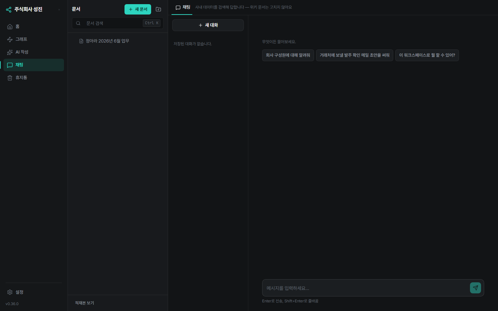

회사 구성원·거래처·업무 내역·문서 등 사내 사실을 물으면 AI가 지식 그래프 3곳(이메일·카카오톡·업무 문서)과 위키를 검색해 답합니다.

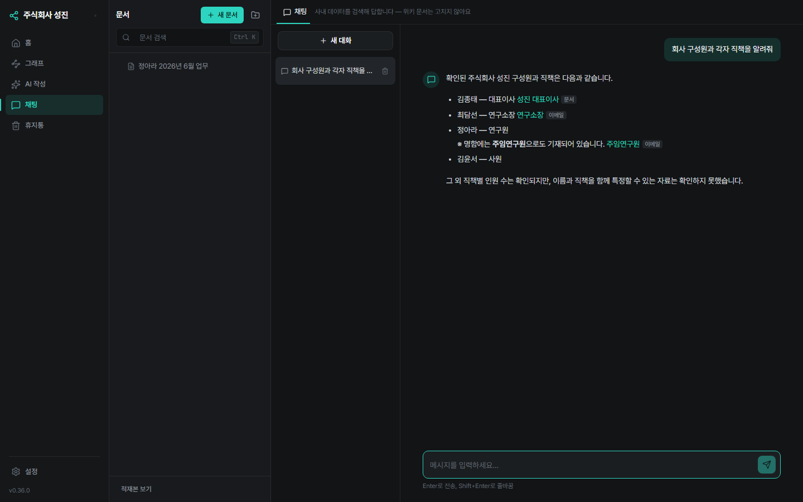

- 답변의 각 항목에는 **근거 문서 링크 + 출처 배지**가 달립니다. 클릭하면 원문 문서로 이동합니다.
- 대화는 좌측 목록에 저장되어 이어갈 수 있고, 휴지통 아이콘으로 삭제할 수 있습니다.
- 일반 지식 질문(글쓰기·번역 등)은 검색 없이 바로 답합니다.
- 사내 데이터 검색이 필요한 질문은 첫 응답까지 수십 초 걸릴 수 있습니다.
- 채팅은 위키 문서를 고치지 않습니다 — 문서 생성은 **AI 작성**을 사용하세요.

---

## 7. AI 작성

사이드바 **AI 작성**에서 질문 하나로 정리 문서를 만듭니다.

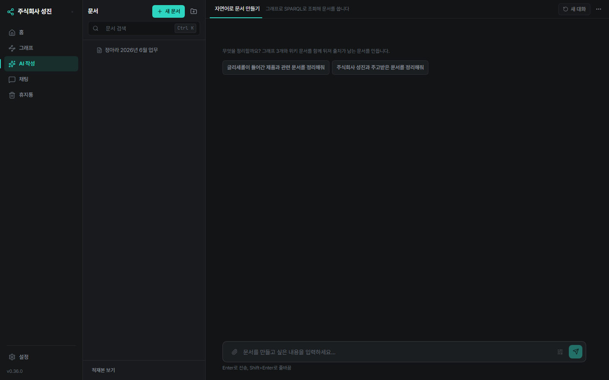

- 예: "정아라의 2026년 6월 업무를 정리해줘", "주식회사 성진과 두젠바이오 사이의 계약과 견적을 정리해줘"
- AI가 지식 그래프 3곳을 조회해 근거를 모으고, 표·목록으로 정리된 문서를 작성합니다. 본문 항목마다 근거 문서 링크와 출처 배지가 달립니다.
- 작성이 끝나면 **자동으로 위키에 저장**되며 트리에서 바로 열 수 있습니다.
- 전체 과정은 1~3분 정도 걸리고, 진행 상황(용어 추출 → 그래프 조회 → 작성)이 실시간으로 표시됩니다.

---

## 8. 그래프

사이드바 **그래프**에서 문서 사이의 `[[링크]]` 연결을 한눈에 봅니다.

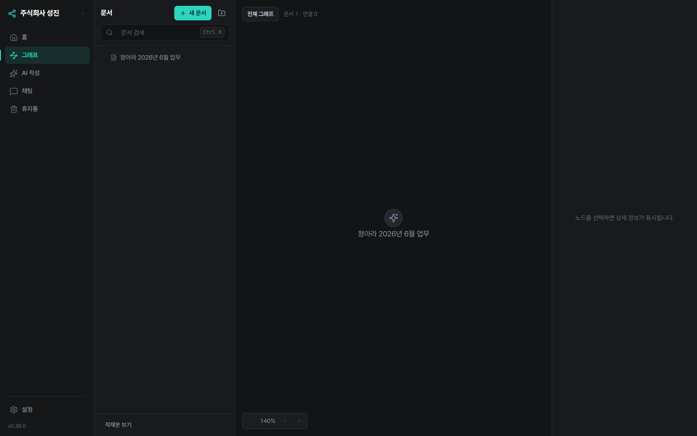

- 사람·AI가 만든 문서를 노드로, 링크를 선으로 그립니다(자동 적재 문서 18만 건은 제외 — 포함하면 화면이 키워드 구름이 됩니다).
- 휠로 확대/축소, 드래그로 이동. 노드를 선택하면 오른쪽에 상세 정보가 뜨고 문서로 이동할 수 있습니다.

---

## 9. 휴지통

삭제한 문서와 폴더는 **7일간 보관** 후 자동 영구 삭제됩니다.

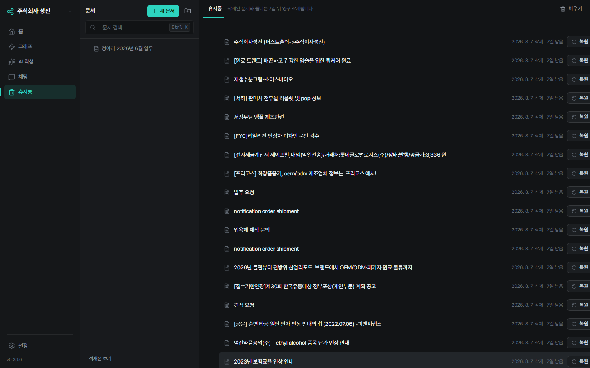

- **복원**: 각 항목의 복원 버튼. 원래 위치가 사라졌으면 최상위로 복원됩니다.
- **비우기**: 우측 상단 비우기 버튼으로 즉시 영구 삭제(되돌릴 수 없음).

---

## 10. 설정

사이드바 하단 **설정**에서 시스템 상태를 확인합니다.

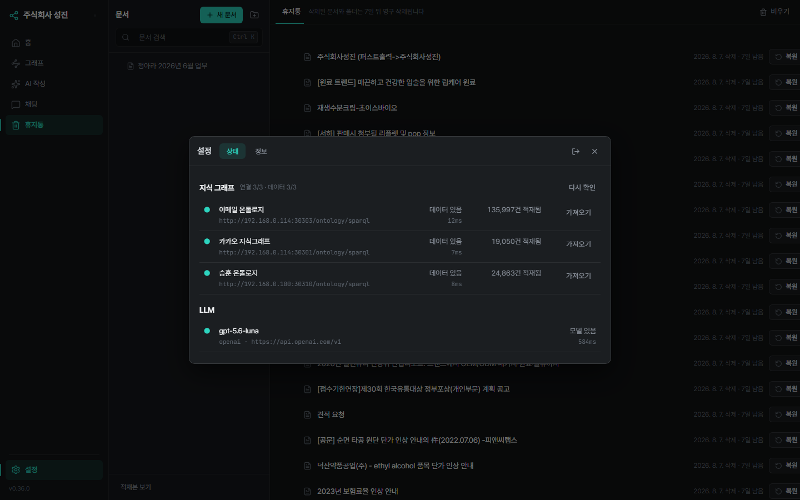

- **지식 그래프**: 소스 3곳의 연결 상태·적재 건수. **가져오기** 버튼으로 온톨로지를 다시 적재합니다(이메일 소스는 10분 이상 소요). 재적재는 자동 적재 문서만 갱신하며, 사람이 고친 문서는 덮지 않습니다.
- **LLM**: AI 모델 연결 상태.
- 우측 상단 아이콘으로 **로그아웃**합니다.

---

## 자주 묻는 질문

**Q. 링크를 눌렀는데 "문서가 없습니다"가 나옵니다.**
AI가 생성한 문서의 링크 중 극히 일부는 대상 문서가 없을 수 있습니다. 해당 화면에서 새 문서를 만들거나 뒤로 가면 됩니다.

**Q. 채팅과 AI 작성의 차이는?**
채팅은 묻고 답하는 대화(위키에 저장 안 됨), AI 작성은 위키 문서를 만들어 저장하는 기능입니다.

**Q. 문서를 실수로 지웠어요.**
휴지통에서 7일 안에 복원할 수 있습니다.

**Q. 예전에 만든 AI 문서에는 근거 링크가 없어요.**
근거 링크는 최근 버전부터 지원됩니다. AI 작성에서 같은 요청을 다시 실행하면 링크가 포함된 새 문서가 만들어집니다.
